# 软考突击 - 必考图表速记

> 按考试频率排序，红色最高频，橙色中高频，黄色中频

---

## 🔴 1. 权力/利益方格（⭐⭐⭐⭐⭐ 必考！）

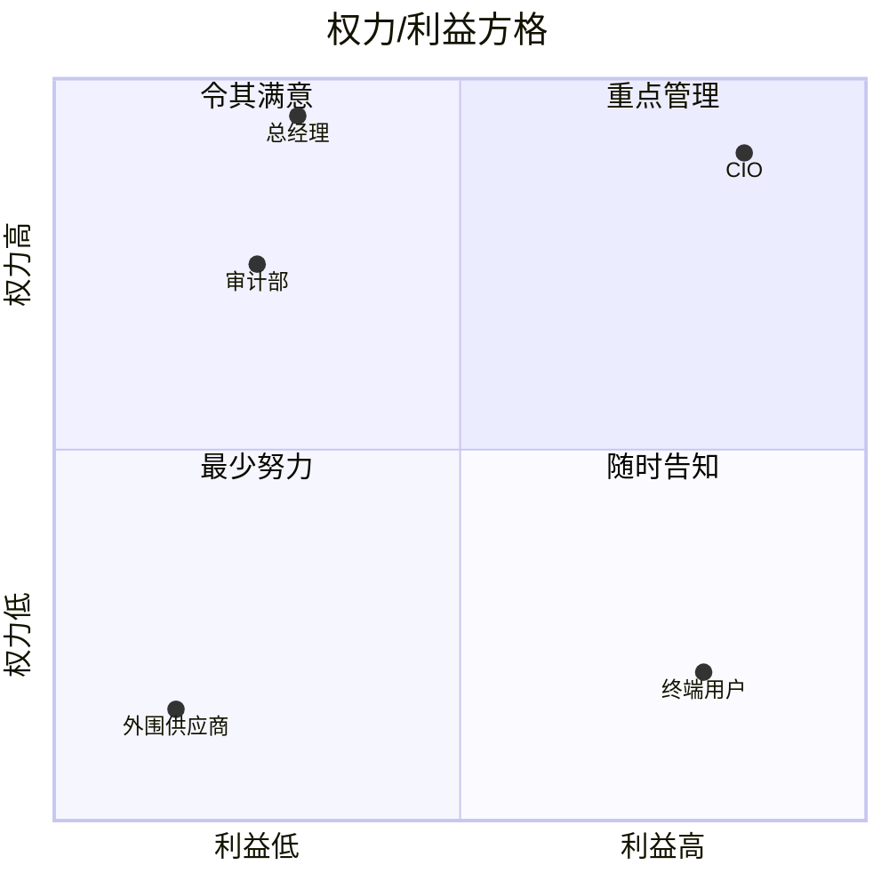

**口诀**：大权大利重点管，大权利小让他满，小权利大告诉他，小权小利少费力

| 象限 | 策略 | 典型干系人 | 怎么做 |
|------|------|-----------|--------|
| 重点管理（权力大+利益大） | 密切管理 | CIO、信息中心主任 | 每周当面汇报，重大决策请参与 |
| 令其满意（权力大+利益小） | 让他满意 | 总经理、审计部 | 月度经营驾驶舱，关注投资回报 |
| 随时告知（权力小+利益大） | 保持告知 | 终端用户、子公司IT | 周进度同步+操作培训 |
| 最少努力（权力小+利益小） | 花最少精力 | 外围供应商 | 文档存档备查即可 |

**易错点**：权力大≠利益大！审计部权力大但利益小→令其满意，不是重点管理

---

## 🔴 2. 挣值分析公式体系（⭐⭐⭐⭐⭐ 计算题必考！）

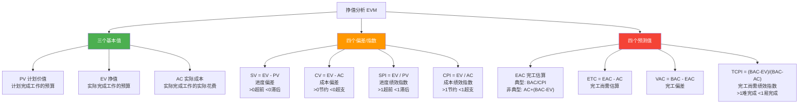

**核心记忆**：
- **EV在前都是好的** — SV、CV、SPI、CPI，EV在减数/分子位置，EV越大越好
- **SPI看进度，CPI看成本**
- **>1都是好事**（超前/节约），**<1都是坏事**（滞后/超支）
- **典型偏差**：偏差会持续→EAC = BAC/CPI
- **非典型偏差**：偏差是一次性的→EAC = AC + (BAC-EV)

---

## 🔴 3. 变更控制流程（⭐⭐⭐⭐⭐ 必考！）

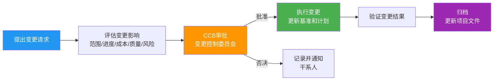

**口诀**：提评批执验归 — 提出、评估、审批、执行、验证、归档

**关键考点**：
- CCB（变更控制委员会）负责审批，不是项目经理审批
- 变更必须评估对范围、进度、成本、质量、风险的**全面影响**
- 适应型项目用**待办事项列表**调整优先级，预测型项目走**变更控制流程**
- 口头变更不算数，必须书面记录

---

## 🔴 4. 风险应对策略（⭐⭐⭐⭐⭐ 必考！）

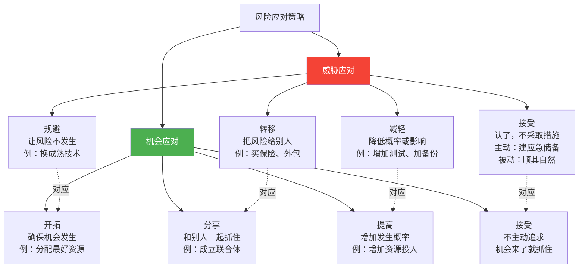

**速判技巧**：
- 看到"买保险""签合同""外包"→ **转移**
- 看到"改变方案""不做某事"→ **规避**
- 看到"降低""减少""增加测试"→ **减轻**
- 看到"不采取措施""顺其自然"→ **接受**
- 威胁和机会一一对应：规避↔开拓、转移↔分享、减轻↔提高、接受↔接受
- **上报策略**：超出权限范围的风险，上报给更高层级

---

## 🔴 5. Tuckman团队发展5阶段（⭐⭐⭐⭐⭐ 必考！）

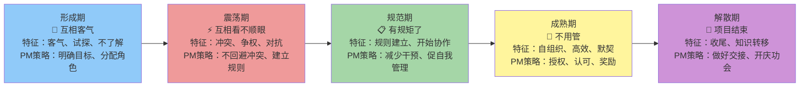

**口诀**：形震规成解 — 形成、震荡、规范、成熟、解散

**考试重点**：
- **震荡期**最容易考！冲突最多，PM不能回避
- 新成员加入→团队会**回到形成期**，重新经历各阶段
- 震荡期是**正常现象**，不是团队出了问题

---

## 🟠 6. 质量成本COQ分类（⭐⭐⭐⭐）

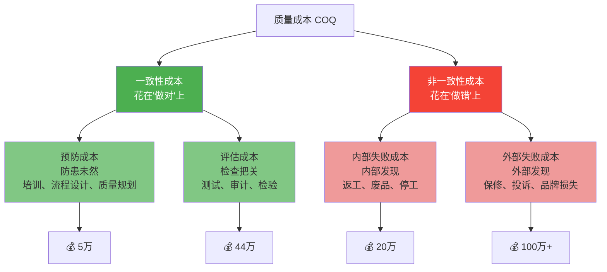

**口诀**：预评内外 — 预防、评估、内部失败、外部失败

**速判**：
- "培训" = 预防 | "测试" = 评估 | "返工" = 内部失败 | "投诉" = 外部失败
- **越早投入越省钱**：预防5万 >> 外部失败100万+
- 五种质量管理水平（有效性递增）：客户发现缺陷 < 控制质量检测 < 质量保证纠正 < 质量融入规划设计 < 创建质量文化

---

## 🟠 7. 七种基本质量工具（⭐⭐⭐⭐）

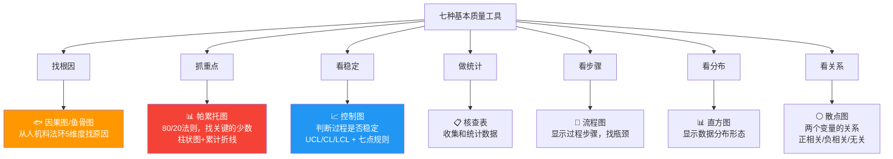

**口诀**：因流核帕直控散 — 因果图、流程图、核查表、帕累托图、直方图、控制图、散点图

**控制图判异规则（必考）**：
1. 数据点**超出控制限** → 过程失控
2. **连续7点**在中心线同侧 → 过程偏移（七点规则）
3. 连续7点呈趋势上升/下降 → 过程在恶化

---

## 🟠 8. 合同类型选择决策（⭐⭐⭐⭐）

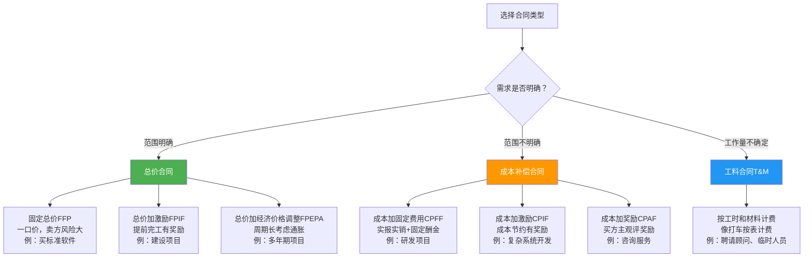

**口诀**：范围明确用总价，范围不明用成本，灵活用工料

**风险分配**：
- 总价合同：买方风险低，卖方风险高
- 成本补偿合同：买方风险高，卖方风险低
- 工料合同：风险适中，双方分担

---

## 🟠 9. 成本基准组成（⭐⭐⭐⭐）

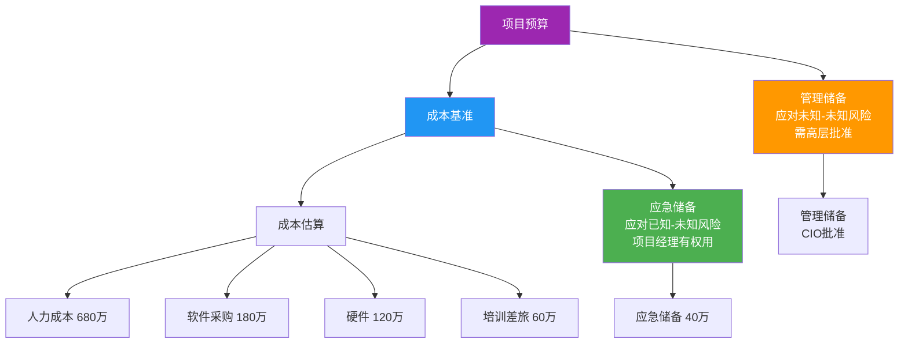

**关键公式**：
- **成本基准 = 成本估算 + 应急储备**
- **项目预算 = 成本基准 + 管理储备**

**应急储备 vs 管理储备**：

| | 应急储备 | 管理储备 |
|--|---------|---------|
| 应对什么 | 已知-未知风险 | 未知-未知风险 |
| 谁有权用 | 项目经理 | 需高层批准 |
| 是否计入基准 | ✅ 计入 | ❌ 不计入 |
| 项目结束 | 未用部分归还组织 | 未用部分归还组织 |

---

## 🟠 10. 开发方法选择决策（⭐⭐⭐⭐）

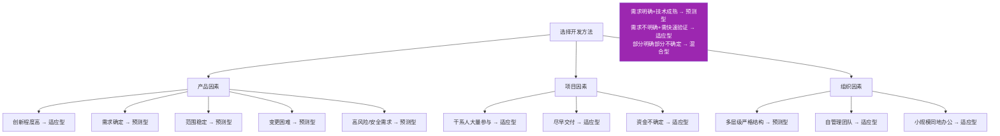

**口诀**：需求明确用预测，需求多变走适应，部分明确选混合

**四种交付节奏**：一次性、多次、定期、持续
- "每两周输出一次可使用的产品版本" → **定期交付**

---

## 🟡 11. 干系人参与度5级（⭐⭐⭐）


**口诀**：不知抵中支领

**关键**：从"抵制"到"支持"不能一步到位，要逐步推进：抵制→中立→支持→领导

---

## 🟡 12. 项目生命周期4阶段（⭐⭐⭐）

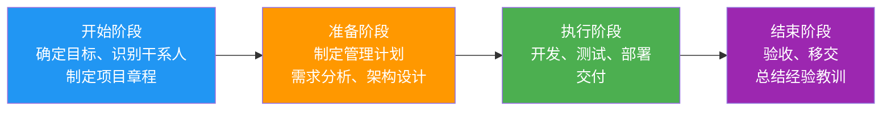

**口诀**：开准执结 — 开始、准备、执行、结束

---

## 🟡 13. 八大绩效域要点→目标映射（⭐⭐⭐ 论文必备）

```mermaid
graph TD
    subgraph 干系人绩效域
        S1[促进干系人参与<br/>识别→分析→排序→参与→监督] --> G1[①关系好 ②认同目标<br/>③满意收益 ④反对者不捣乱]
    end

    subgraph 团队绩效域
        S2[项目团队文化] --> G2[共享责任]
        S3[高绩效项目团队] --> G3[高绩效团队]
        S4[领导力技能] --> G4[展现领导力]
    end

    subgraph 开发生命周期绩效域
        S5[交付节奏+开发方法<br/>+选择因素+协调] --> G5[①方法匹配 ②价值挂钩<br/>③生命周期合理]
    end

    subgraph 规划绩效域
        S6[8个要点] --> G6[6个目标<br/>有条理/系统/演变/适当/充分/可适应]
    end

    subgraph 项目工作绩效域
        S7[8个要点] --> G7[7个目标<br/>高效/过程/沟通/实物/采购/变更/学习]
    end

    subgraph 交付绩效域
        S8[价值交付+可交付物+质量] --> G8[5个目标<br/>目标/预期/收益/需求/满意]
    end

    subgraph 度量绩效域
        S9[6个要点] --> G9[4个目标<br/>理解/决策/行动/价值]
    end

    subgraph 不确定性绩效域
        S10[风险+模糊性+复杂性+应对] --> G10[7个目标<br/>环境/识别/依赖/预测/最小/机会/储备]
    end
```

**各域要点数和目标数速记**：

| 绩效域 | 要点数 | 目标数 | 口诀 |
|--------|-------|-------|------|
| 干系人 | 1 | 4 | 1要点5步循环→4目标 |
| 团队 | 3 | 3 | 文高领→共高领 |
| 开发生命周期 | 4 | 3 | 节奏方法因素协调→匹配价值合理 |
| 规划 | 8 | 6 | 最多要点→有条系统演变适当充分可适应 |
| 项目工作 | 8 | 7 | 最多要点→高效过程沟通实物采购变更学习 |
| 交付 | 3 | 5 | 价值可交付质量→目标预期收益需求满意 |
| 度量 | 6 | 4 | 制定内容展示陷阱诊断改进→理解决策行动价值 |
| 不确定性 | 4 | 7 | 风险模糊复杂应对→7目标最多！环境识别依赖预测最小机会储备 |

---

## 🟡 14. 冲突管理5策略（⭐⭐⭐）

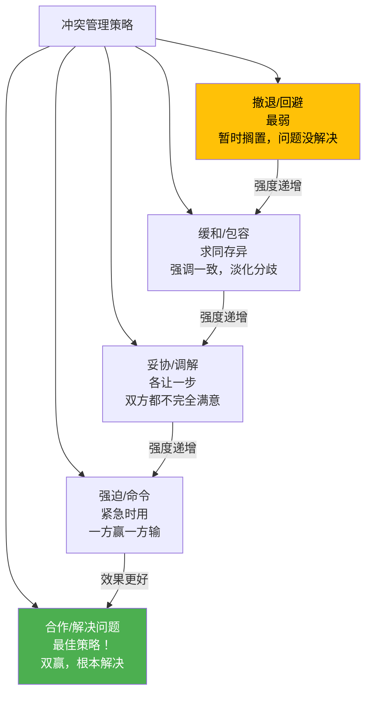

**口诀**：撤缓妥强合 — 撤退、缓和、妥协、强迫、合作

**速判**：
- "先搁置，下周再讨论" → 撤退/回避
- "大家目标一致，别伤和气" → 缓和/包容
- "各让一步" → 妥协/调解
- "我是PM，听我的" → 强迫/命令
- "一起制定规则" → 合作/解决问题（最佳）

---

## 🟡 15. 沟通模型5状态（⭐⭐）

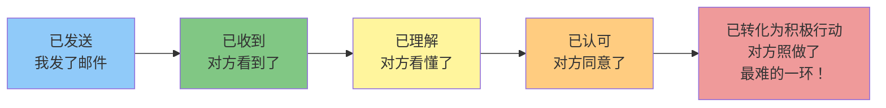

**三种沟通方式**：
- **交互式**：会议、电话 — 双向实时，最可靠
- **推式**：邮件、报告 — 单向发送，最常用
- **拉式**：共享文件夹、知识库 — 被动获取，最省力

**沟通渠道公式**：n(n-1)/2，5人=10条，10人=45条，20人=190条

---

## 📌 附：十大管理过程数速查

| 管理领域 | 过程数 | 过程口诀 |
|---------|-------|---------|
| 整合管理 | 7 | 章计指知监变收 |
| 范围管理 | 6 | 规收定分确控 |
| 进度管理 | 6 | 规定排估制控 |
| 成本管理 | 4 | 规估制控 |
| 质量管理 | 3 | 规管控 |
| 资源管理 | 6 | 规估获建管控 |
| 沟通管理 | 3 | 规管监 |
| 风险管理 | 7 | 规识定规规实监 |
| 采购管理 | 3 | 规实控 |
| 干系人管理 | 4 | 识规管监 |

**总计49个过程**

---

# 🆕 笔记中缺失的必考图表（补充！）

> 以下图表是教材/考试中常见，但你的18个学习笔记里没有画出来的。按重要程度排序。

---

## 🔴 缺-1. 过程组×知识领域映射表（⭐⭐⭐⭐⭐ 最重要！笔记里完全没有！）

这是整个PMBOK最核心的一张表，49个过程分布在5个过程组×10个知识领域。

| 知识领域 | 启动 | 规划 | 执行 | 监控 | 收尾 |
|---------|------|------|------|------|------|
| **4.整合管理** | 制定项目章程 | 制定项目管理计划 | 指导与管理项目工作<br/>管理项目知识 | 监控项目工作<br/>实施整体变更控制 | 结束项目或阶段 |
| **5.范围管理** | | 规划范围管理<br/>收集需求<br/>定义范围<br/>创建WBS | | 确认范围<br/>控制范围 | |
| **6.进度管理** | | 规划进度管理<br/>定义活动<br/>排列活动顺序<br/>估算活动持续时间<br/>制定进度计划 | | 控制进度 | |
| **7.成本管理** | | 规划成本管理<br/>估算成本<br/>制定预算 | | 控制成本 | |
| **8.质量管理** | | 规划质量管理 | 管理质量 | 控制质量 | |
| **9.资源管理** | | 规划资源管理<br/>估算活动资源 | 获取资源<br/>建设团队<br/>管理团队 | 控制资源 | |
| **10.沟通管理** | | 规划沟通管理 | 管理沟通 | 监督沟通 | |
| **11.风险管理** | | 规划风险管理<br/>识别风险<br/>实施定性风险分析<br/>实施定量风险分析<br/>规划风险应对 | 实施风险应对 | 监督风险 | |
| **12.采购管理** | | 规划采购管理 | 实施采购 | 控制采购 | |
| **13.干系人管理** | 识别干系人 | 规划干系人参与 | 管理干系人参与 | 监督干系人参与 | |

**记忆规律**：
- **启动组**只有2个过程：制定项目章程 + 识别干系人
- **收尾组**只有1个过程：结束项目或阶段
- **规划组**最多（24个），**执行组**10个，**监控组**12个
- 风险管理在规划组有5个过程，是最多的
- 质量管理和采购管理在规划组各只有1个过程

---

## 🔴 缺-2. 进度网络图PDM + 四种依赖关系（⭐⭐⭐⭐⭐ 计算题必画！）

### 四种依赖关系图示

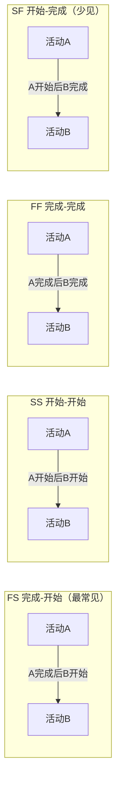

| 依赖类型 | 含义 | 例子 | 分类 |
|---------|------|------|------|
| **FS** 完成-开始 | A完成后B才能开始 | 先打地基再建主体 | 强制性/选择性 |
| **SS** 开始-开始 | A开始后B才能开始 | 挖土开始后运土开始 | 强制性/选择性 |
| **FF** 完成-完成 | A完成后B才能完成 | 写文档完成才能评审完成 | 强制性/选择性 |
| **SF** 开始-完成 | A开始后B才能完成 | 保安接班（新保安开始，旧保安结束） | 极少见 |

### 进度网络图示例（找关键路径）

```mermaid
graph LR
    START((开始)) --> A["A 需求调研<br/>4周"]
    A --> B["B 数据标准<br/>3周"]
    A --> C["C 数据安全<br/>5周"]
    B --> D["D 数据集成<br/>8周"]
    B --> E["E 数据治理<br/>4周"]
    D --> F["F 子公司对接<br/>6周"]
    E --> F
    C --> G["G 安全测评<br/>3周"]
    F --> H["H 联调测试<br/>4周"]
    H --> END((结束))
    G --> END2(())

    style D fill:#F44336,color:#fff
    style F fill:#F44336,color:#fff
    style H fill:#F44336,color:#fff
    style B fill:#F44336,color:#fff
    style A fill:#F44336,color:#fff
```

**关键路径**：A→B→D→F→H = 4+3+8+6+4 = **25周**（红色路径）

**非关键路径**：A→C→G = 4+5+3 = 12周，浮动时间 = 25-12 = **13周**

**关键路径判断**：总浮动时间=0的路径就是关键路径，关键路径上任何延误都导致项目延期

---

## 🔴 缺-3. S曲线 / 挣值分析可视化（⭐⭐⭐⭐⭐ 公式会了还要会看图！）

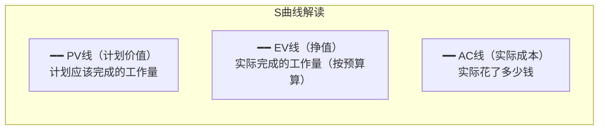

```
预算(万)
 800│                    ╱──── PV（计划价值）
    │                 ╱
 600│              ╱     ──── EV（挣值）
    │           ╱╱
 400│        ╱╱ ──────── AC（实际成本）
    │     ╱╱
 200│  ╱╱
    │╱
  0└──────────────────────→ 时间
    0   2   4   6   8   10  月

解读（第6个月末）：
  PV = 620万（计划应该完成620万的工作）
  EV = 580万（实际只完成了580万的工作）  ← EV < PV，进度滞后
  AC = 610万（实际花了610万）            ← AC > EV，成本超支

  SV = EV-PV = -40万 < 0  → 进度滞后
  CV = EV-AC = -30万 < 0  → 成本超支
  SPI = EV/PV = 0.94 < 1  → 进度滞后6%
  CPI = EV/AC = 0.95 < 1  → 成本超支5%
```

**看图口诀**：
- EV在PV下方 → 进度滞后（活干少了）
- AC在EV上方 → 成本超支（钱花多了）
- 三线重合 → 一切正常

---

## 🟠 缺-4. WBS树形分解图（⭐⭐⭐⭐ 范围管理核心图！）

```
                        ┌──────────────────┐
                        │ 1.0 工程数据治理  │  ← 第1层：项目总目标
                        │     平台项目      │
                        └────────┬─────────┘
                ┌────────┬───────┼───────┬────────┐
         ┌──────┴──┐ ┌───┴──┐ ┌──┴──┐ ┌──┴──┐ ┌───┴────┐
         │1.1 数据 │ │1.2   │ │1.3  │ │1.4  │ │ 1.7    │  ← 第2层：7大模块
         │ 标准    │ │集成   │ │开发  │ │治理  │ │ 数据应用│
         └────┬────┘ └──┬───┘ └──┬──┘ └──┬──┘ └───┬────┘
              │         │        │       │        │
         ┌────┼────┐   ...     ...    ...      ...
    ┌────┴─┐ ┌─┴──┐                                    ← 第3层：子功能
    │1.1.1 │ │1.1.2│
    │标准  │ │标准 │
    │制定  │ │评审 │
    └──┬───┘ └─────┘
       │                                      ← 第4层：工作包
  ┌────┴────┐                                （每个≤80小时）
  │1.1.1.1  │
  │元数据   │
  │标准制定 │
  └─────────┘

分解原则：
  ✅ 100%规则：子项之和 = 父项，不多不少
  ✅ 互斥原则：一个活只挂一个地方
  ✅ 4-6层：不要太深也不要太浅
  ✅ 工作包≤80小时（2人周）
  ✅ 每个工作包只有1个人负责
  ✅ WBS包括项目管理工作
  ✅ 所有主要干系人参与编制
  ✅ WBS并非一成不变
```

---

## 🟠 缺-5. 风险概率影响矩阵（⭐⭐⭐⭐ 笔记提到了但没画！）

```
              影 响
         低      中      高
    ┌────────┬────────┬────────┐
 高 │ 🟡     │ 🟠     │ 🔴     │
    │ 中风险  │ 高风险  │ 最高风险│
概  ├────────┼────────┼────────┤
 中 │ 🟢     │ 🟡     │ 🟠     │
    │ 低风险  │ 中风险  │ 高风险  │
率  ├────────┼────────┼────────┤
 低 │ ⚪     │ 🟢     │ 🟡     │
    │ 可忽略  │ 低风险  │ 中风险  │
    └────────┴────────┴────────┘

颜色越深 = 优先级越高 = 必须重点应对

项目实例：
  🔴 老旧系统接口文档缺失（概率高+影响高）→ 最先处理
  🟠 达梦与Oracle不兼容（概率中+影响高）→ 重点应对
  🟡 子公司数据标准不统一（概率高+影响中）→ 需要关注
  🟢 项目部人员不配合（概率中+影响中）→ 一般关注
  ⚪ 外围供应商变更（概率低+影响低）→ 可接受
```

---

## 🟠 缺-6. 决策树 + EMV计算（⭐⭐⭐⭐ 定量风险分析必考！）

```
                    ┌── 成功(60%) ── 收益100万 ── 60万
                    │
  方案A ── 投资30万 ─┤
  (新技术)           │
                    └── 失败(40%) ── 损失50万 ── -20万

  EMV(A) = 60 + (-20) = 40万
  净EMV(A) = 40 - 30 = 10万 ✅ 选A


                    ┌── 成功(80%) ── 收益60万 ── 48万
                    │
  方案B ── 投资10万 ─┤
  (成熟技术)         │
                    └── 失败(20%) ── 损失20万 ── -4万

  EMV(B) = 48 + (-4) = 44万
  净EMV(B) = 44 - 10 = 34万 ✅ 选B（净EMV更高）

EMV = 每个结果的概率 × 收益/损失，然后求和
决策规则：选净EMV最大的方案
```

---

## 🟠 缺-7. 范围基准组成（⭐⭐⭐⭐）

```
            ┌─────────────────────────────────────┐
            │           范 围 基 准                │
            │   （经过批准的"冻结版"范围文件）       │
            └──────────────┬──────────────────────┘
                           │
          ┌────────────────┼────────────────┐
          │                │                │
  ┌───────┴───────┐ ┌─────┴─────┐ ┌───────┴───────┐
  │ 项目范围说明书 │ │   WBS     │ │  WBS词典      │
  │               │ │           │ │               │
  │ ·产品范围描述  │ │ ·分解结构 │ │ ·每个工作包   │
  │ ·可交付成果   │ │ ·工作包   │ │  的详细描述   │
  │ ·验收标准    │ │ ·控制账户 │ │ ·活动清单     │
  │ ·除外责任    │ │ ·规划包   │ │ ·资源需求     │
  │ ·项目边界    │ │           │ │ ·验收标准     │
  └───────────────┘ └───────────┘ └───────────────┘

关键：范围基准 = 范围说明书 + WBS + WBS词典
      三者作为一个整体，变更时一起变更
```

---

## 🟡 缺-8. 沟通模型完整图（⭐⭐⭐）

```
  发送方                                  接收方
  ┌──────┐    ┌──────┐    ┌──────┐    ┌──────┐
  │ 编码  │───→│ 传输  │───→│ 解码  │───→│ 确认  │
  │      │    │      │    │      │    │      │
  │把想法 │    │通过媒介│    │理解信息│    │反馈收到│
  │变成信息│    │传递信息│    │还原含义│    │      │
  └──────┘    └──────┘    └──────┘    └──────┘
      ↑            ↑            ↑
      │     ┌──────┤            │
      │     │ 噪声  │            │
      │     │ 干扰  │            │
      │     │(误解/ │            │
      │     │ 技术故障)          │
      │     └──────┘            │
      │                         │
      └─────── 反馈 ────────────┘

5种状态（递进关系）：
  已发送 → 已收到 → 已理解 → 已认可 → 已转化为积极行动
  (最易)                                    (最难)

噪声来源：术语不一致、文化差异、情绪状态、技术故障、信息过载
```

---

## 🟡 缺-9. 燃尽图（⭐⭐⭐ 敏捷项目进度跟踪）

```
剩余工作量
  │╲
  │ ╲──── 理想线（计划消耗速度）
  │  ╲
  │   ╲
  │    ╲●  ← 实际线在理想线上方 = 进度滞后
  │     ╲ ●
  │      ╲  ●
  │       ╲   ●
  │        ╲    ●
  │         ╲     ●
  │          ╲      ● ← 实际线在理想线下方 = 进度超前
  │           ╲
  └──────────────→ 迭代天数
  0  2  4  6  8  10

解读：
  实际线在理想线上方 → 剩余工作比计划多 → 进度滞后
  实际线在理想线下方 → 剩余工作比计划少 → 进度超前
  实际线趋近于0 → 即将完成

vs 燃起图：已完成的累计工作量，越往上越好
```

---

## 🟡 缺-10. 赶工 vs 快速跟进对比图（⭐⭐⭐）

```
原始计划（串行）：
  ┌─────────┐   ┌─────────┐
  │  设计    │──→│  开发    │   总工期 = 4+6 = 10周
  │  4周     │   │  6周     │
  └─────────┘   └─────────┘

赶工（加资源换时间）：
  ┌─────────┐   ┌─────────┐
  │  设计    │──→│ 开发×2人 │   总工期 = 4+3 = 7周
  │  4周     │   │  3周     │   成本增加！风险：低
  └─────────┘   └─────────┘

快速跟进（串行变并行）：
  ┌─────────┐
  │  设计    │──→┌─────────┐
  │  4周     │   │  开发    │   总工期 = 4+2 = 6周（重叠4周）
  └─────────┘   │  6周     │   成本不变！风险：高（返工）
                └─────────┘

对比：
  ┌──────────┬──────────┬──────────┐
  │          │   赶工    │ 快速跟进  │
  ├──────────┼──────────┼──────────┤
  │ 核心做法 │ 加资源    │ 串改并    │
  │ 成本影响 │ 增加💰    │ 不变      │
  │ 风险     │ 低        │ 高（返工）│
  │ 适用场景 │ 有钱没时间 │ 没钱有时间│
  └──────────┴──────────┴──────────┘
```

**缩短工期6种方法口诀**：赶快搞范进质
1. **赶**工 — 加资源
2. **快**速跟进 — 串改并
3. **搞**素质 — 用高素质人员
4. **范**围 — 减少范围或降低要求
5. **进**技术 — 改进方法提高效率
6. **质**量 — 加强质量管理减少返工
